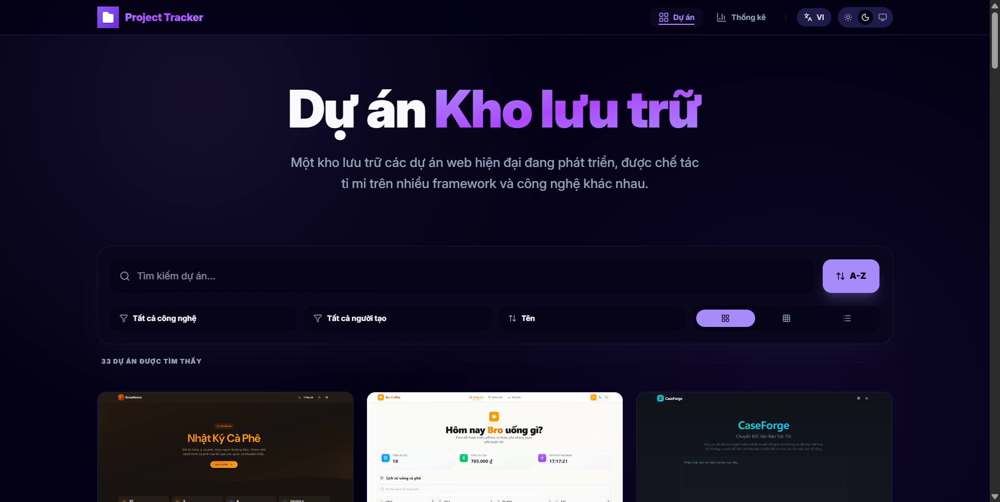

# MyProjects 🚀

A high-performance, premium **Project Repository Ecosystem** built with React, Vite, and **Tailwind CSS v4**. Designed with a minimalist **One UI 6 Style** aesthetic and an **Emerald Green** brand identity.

📸 Screenshot


## ✨ Premium Features
- **One UI 6 Style Branding**: Minimalist, high-contrast UI with a custom Emerald Green visual language.
- **Dynamic View Modes**: Switch between **Grid**, **List**, and **Compact** views to explore projects.
- **PWA Excellence**: Fully installable as a native app on iOS, Android, and Desktop with offline capability.
- **Advanced Repository Metrics**: Comprehensive analytics dashboard visualizing technical complexity and tech stack distribution.
- **Live Search & Matrix Filtering**: Effortless navigation through technical layers and assistance models.
- **Copy-to-Clipboard**: Quick-share links for every project with integrated **Toast Notifications**.
- **Multilingual Core**: Full **i18n** support for English and Vietnamese.
- **System-Aware Themes**: Fluid transitions between Light, Dark, and System theme preferences.

## 🛠️ Technical Engine
- **Core**: React 19 + TypeScript
- **Styling**: Tailwind CSS v4 (Modern JIT Engine)
- **State Architecture**: Context-driven architecture for Toasts, Theme, and Repository data.
- **Motion**: High-fidelity animations powered by Framer Motion.
- **Analytics**: Data visualization via Recharts.
- **Infrastructure**: Vite 7 + Vite PWA Plugin.

## 🚀 Setup & Execution

1. **Clone & Initialize**
   ```bash
   git clone [repository-url]
   cd MyProjects
   ```

2. **Sync Dependencies**
   ```bash
   npm install
   ```

3. **Launch Terminal (Dev)**
   ```bash
   npm run dev
   ```

4. **Production Compilation**
   ```bash
   npm run build
   ```

## 📦 Architecture Breakdown
- `src/components`: Atomic UI components (Project cards, Dynamic Navbar, Footer).
- `src/context`: Global application state (Toasts, i18n).
- `src/hooks`: Custom logic hooks (Theme engine, PWA installation, Project sync).
- `src/pages`: Feature-rich page layouts (Repository Hub, Analytics).

## 📱 PWA Integration
The application is optimized for the **Vite PWA Plugin**. When hosted via HTTPS, users can "Install App" directly from the navigation bar. The app uses a customized `logo.svg` as the source for the app icon, ensuring high-fidelity rendering across mobile home screens.

## 🌐 Deployment
Optimized for **Vercel** or **Netlify**:
- **Build Command**: `npm run build`
- **Output Directory**: `dist`

---
Built with precision by **TrongSigmaPro** 🌿
